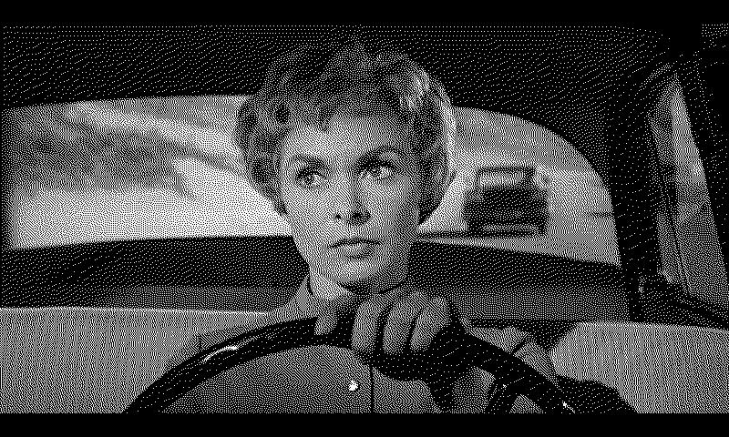

# slowdrive-in

Upload dithered screenshots of movies to ~~instagram~~. The instagram API is pretty locked down now. Time for a new plan??

Most of this code is from https://github.com/TomWhitwell/SlowMovie but I've adapted it to upload photos ~~to Instagram~~.